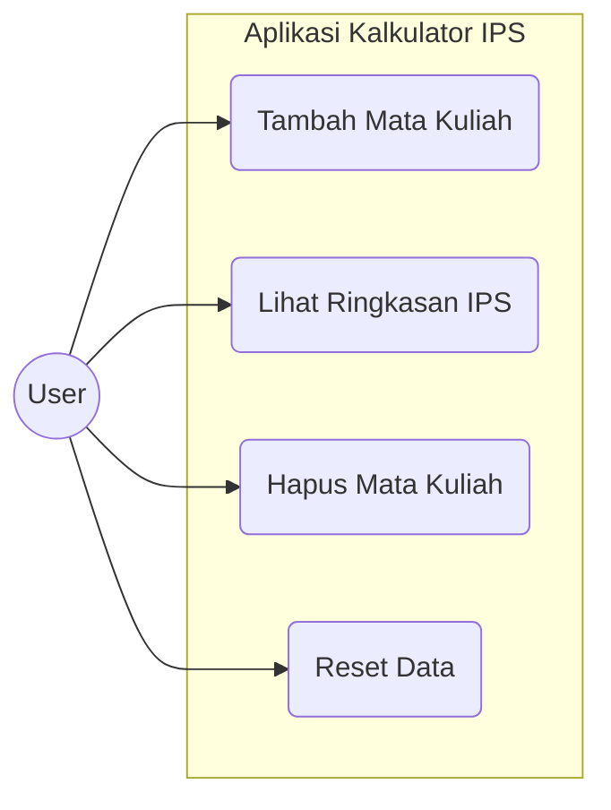
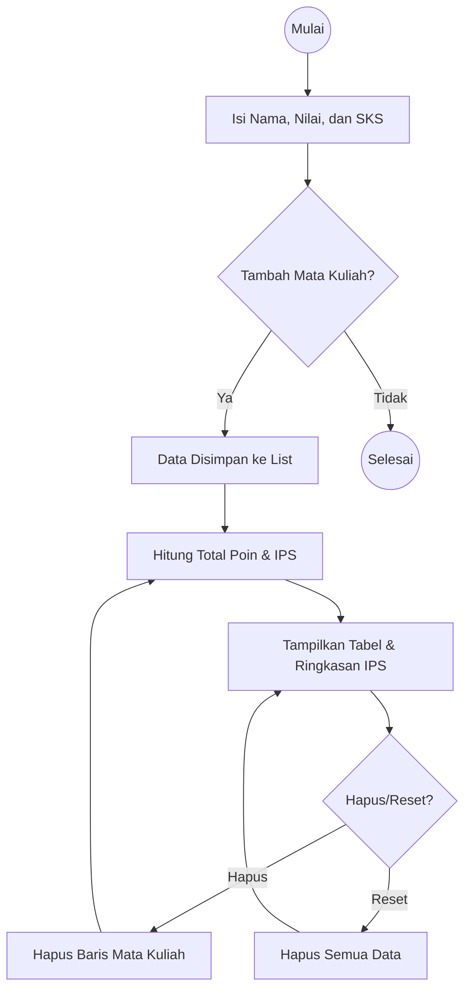
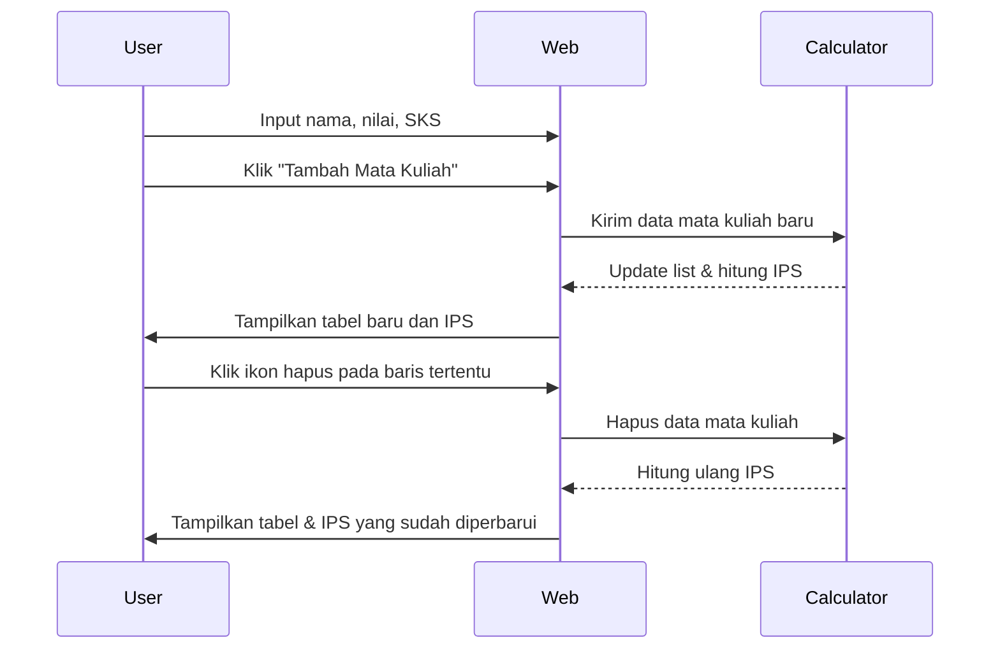

# Laporan Progress Project Aplikasi Web Kalkulator IPS

Aplikasi web untuk menghitung Indeks Prestasi Semester (IPS) secara otomatis berdasarkan daftar mata kuliah, nilai, dan jumlah SKS.
***
#### Nama       : Hinggil Parahita 
#### Kelas      : II RKS A 
#### NPM        : 2423102033
***

## 1. Deskripsi
Kalkulator IPS Semester adalah aplikasi web-based sederhana yang bertujuan mempermudah Taruna menghitung Indeks Prestasi Semester secara cepat dan akurat. Aplikasi ini menyelesaikan masalah konversi nilai skor (0-100) ke nilai huruf/mutu dan perhitungan rata-rata IPS yang sering memakan waktu jika dilakukan manual. Karena terbatasnya akses Taruna terhadap hasil nilai pada setiap semester membuat penulis mencoba mengembangkan aplikasi Kalkulator IPS Semester ini agar memudahkan Taruna dalam memprediksi nilai IPK yang dicapai sehingga bisa mempersiapkan segala hal, termasuk meningkatkan prestasi lebih banyak serta memberikan gambaran cepat mengenai performa akademik dan membantu perencanaan studi semester berikutnya. Kemudian, dalam penggunaannya juga sudah diimplementasikan seperti sistem DHS dari bagian Administrasi, Akademik dan Kemahasiswaan sehingga benar benar memprediksi secara keseluruhan.

## 2. User Story
Sebagai pengguna, saya ingin:

-	Saya ingin menambah dan menghapus mata kuliah di tabel agar daftar mata kuliah semester saya sesuai.
-	Saya ingin memasukkan skor akhir (0-100) untuk setiap mata kuliah agar sistem dapat mengonversi dan menghitung Nilai Mutu otomatis.
-	Saya ingin melihat nilai IPS final secara jelas agar saya bisa memprediksi hasil akademik saya.

## 3. SRS (Software Requirements Specification)
### 3.1 Lingkup Sistem
Sistem berfungsi sebagai kalkulator IPS sederhana untuk satu semester, dengan fokus pada kemudahan input data, visualisasi hasil IPS, dan pengelolaan daftar mata kuliah.

### 3.2 Kebutuhan Fungsional
#### a. Manajemen Mata Kuliah
- User dapat menambahkan data mata kuliah melalui form berisi:
  - Nama mata kuliah.  
  - Nilai angka (rentang 0–100).  
  - SKS (dipilih dari opsi tertentu, misalnya 1–4 SKS).
- Data yang berhasil ditambahkan akan muncul di tabel daftar mata kuliah.
- User dapat menghapus satu baris mata kuliah melalui tombol/ikon hapus di kolom Aksi.
  
#### b. Konversi Nilai & Perhitungan IPS
- Sistem mengonversi nilai angka menjadi:
  - Nilai huruf (A, B, C, D, E) sesuai rentang nilai yang ditentukan.  
  - Nilai poin skala 0–4 (misalnya A = 4.0, B = 3.0, dst.).
- Sistem menghitung **Total Poin Kualitas** dengan rumus:  

- Sistem menghitung **IPS** dengan rumus:
  
  

  dan menampilkannya dalam skala 4.0 beserta label kualitas singkat, misalnya “Sangat Baik”.

#### d. Ringkasan & Tampilan Dashboard
- Menampilkan kartu **IPS Saat Ini** yang berisi:
  - Nilai IPS (misalnya 3.75 / 4.0).  
  - Label kualitas seperti “Sangat Baik”, “Baik”, dll berdasarkan rentang IPS.
- Menampilkan kartu **Total Mata Kuliah** yang sedang dihitung pada semester tersebut.
- Menampilkan tabel daftar mata kuliah dengan kolom:
  - Nama Mata Kuliah  
  - Nilai  
  - Huruf  
  - Poin  
  - SKS  
  - Aksi (hapus)

#### e. Pengelolaan Data
- Data yang diinput disimpan dalam struktur JSON di sisi klien atau backend (misalnya Local Storage / database) agar dapat digunakan kembali selama sesi.
- Fitur **Reset Data** untuk menghapus semua data mata kuliah dan mengembalikan tampilan ke kondisi awal.
  
### 3.3 Kebutuhan Non-Fungsional
- **Usability:** Antarmuka sederhana, responsif, dan mudah dipahami pengguna baru.
- **Performance:** Perhitungan IPS dilakukan instan setelah data diubah tanpa reload penuh halaman.
- **Compatibility:** Dapat berjalan di browser modern (Chrome, Edge, Firefox, dll.) tanpa instalasi tambahan.

## 4. UML Diagram
### a. Use Case Diagram

### b. Activity Diagram

### c. Sequence Diagram

***

## 5. Mock-Up
### a. Tampilan Dashboard
- Kartu **IPS Saat Ini** di sisi kiri menampilkan angka IPS, skala 4.0.
- Kartu **Total Mata Kuliah** di sisi kanan menampilkan jumlah mata kuliah yang telah diinput.

### b. Form Tambah Mata Kuliah
- Terdapat tiga input: `Nama Mata Kuliah`, `Nilai (0–100)`, dan `SKS` (dropdown).
- Tombol berwarna ungu “+ Tambah Mata Kuliah” digunakan untuk menyimpan data ke tabel dan menghitung IPS.
  
### c. Tabel Mata Kuliah
- Tabel menampilkan setiap data mata kuliah dengan kolom:
  - Nama Mata Kuliah (misal: *etsan*, *matdis*).  
  - Nilai (contoh: 84.00, 99.00).  
  - Huruf (contoh: B, A).  
  - Poin (contoh: 3.0, 4.0).  
  - SKS (contoh: 1, 3).  
  - Aksi (ikon tempat sampah merah untuk menghapus baris).
- Desain menggunakan tema warna lembut dengan aksen ungu pada tombol dan border sehingga tampilan bersih dan modern.

